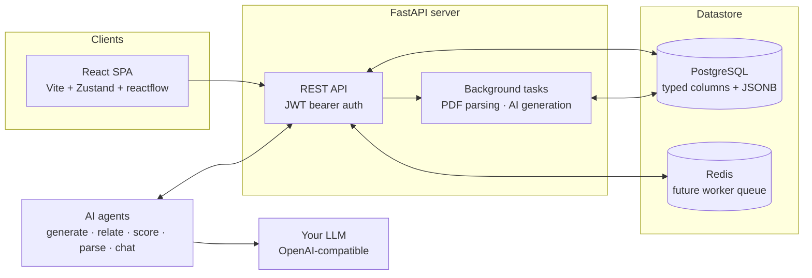

<div align="center">


# Career Assistant
### AI-guided career discovery for students

[](https://github.com/neuronection/career-assistant/releases)
[](#scope--limitations)
[](LICENSE)
[](#quick-start)
[](https://fastapi.tiangolo.com/)
[](https://react.dev/)
[](https://www.docker.com/)

<br>

**Website**: [neuronection.com](https://neuronection.com) · **Repository**: [neuronection/career-assistant](https://github.com/neuronection/career-assistant)

</div>

> Part of the Neuronection assistant family — explore all projects at [neuronection.com](https://neuronection.com).

---

## Table of contents

- [What is Career Assistant?](#what-is-career-assistant)
- [What's different](#whats-different)
- [Features](#features)
- [Structured by design](#structured-by-design)
- [Quick start](#quick-start)
- [Architecture at a glance](#architecture-at-a-glance)
- [Documentation](#documentation)
- [Tech stack](#tech-stack)
- [Scope & limitations](#scope--limitations)
- [Status & roadmap](#status--roadmap)
- [Contributing](#contributing)
- [License](#license)
- [Disclaimer](#disclaimer)

---

## What is Career Assistant?

A self-hosted web app that helps students discover which jobs actually exist, understand which ones fit their interests, personality and constraints, and find the university pathways that lead to them — with AI woven through every step.

Under the hood it's a **structured knowledge platform**: a job catalog organized as a family tree plus a typed relation graph, deep structured student profiles, and university admissions data — all referenced by stable keys, never loose labels. AI generates jobs, suggests relations, and scores matches, but every output is validated into typed structures and audited.

It is **Alpha** software, built for students and technical self-hosters first.

## What's different

- **Structure over plain text.** Everything AI produces is pydantic-validated into typed JSONB shapes (`{tag_key, weight}`, `{title, detail, weight}`) and mapped onto a controlled taxonomy. Free text is allowed only as supporting `detail` — the data stays parseable and knowledge-extractable.
- **A graph, not a list.** Jobs relate through typed edges (`similar_to`, `specialises_into`, `leads_to`, `alternative_to`, `prerequisite_of`), so "what's adjacent to this?" and "what does this lead to?" are traversals, not guesswork.
- **The AI assists — it never silently decides.** Generated jobs land in a review pipeline, PDF admissions data is parsed into a reviewable draft before it touches the catalog, and every match score comes with a rationale you can read, agree or disagree with, and override with your own score.
- **Human + AI scoring.** AI scores 0–10 with positives, negatives and prerequisite checks; you score 0–10 and tag your interest status. Rankings combine both and are heavily filterable.
- **Bring your own LLM.** Any OpenAI-compatible provider works: OpenAI, OpenRouter, a local model via Ollama or LM Studio. Configured per instance, entirely through the UI.

## Features

### Explore a living job catalog

- **Family tree + relation graph** — browse job families as a tree, then follow typed relations in an interactive graph. Careers are positioned, not just listed.
- **Rich structured attributes per job** — interests, skills, work style, education, physical demands, salary bands, demand outlook, environments, typical positives and negatives.
- **AI-generated jobs** — extend the catalog with new careers; the generator maps output onto the existing taxonomy so nothing becomes an orphan of free text.
- **Search and filter** across the whole catalog.

### Build a deep, structured profile

- **Onboarding wizard** walks you through interests, skills, work-style preferences, education and constraints.
- **Everything is typed** — profile sections are structured JSONB validated against the taxonomy, so matching is computed, not vibes.
- **AI profile analysis** — get an external read on your profile and what it implies.

### Get matched, with reasons

- **Per-job match insights** — an AI score (0–10) with structured rationale: what fits (positives), what doesn't (negatives), and which prerequisites you're missing.
- **Your voice counts** — add your own score and interest status per job; AI and human scores coexist.
- **Filterable rankings** — combine AI score, your score and status, then slice by filters to get a shortlist you trust.

### Find the university pathway

- **Upload your university admission PDF** — an AI parsing pipeline extracts universities, departments and yearly admission baselines into a reviewable draft.
- **You approve every write** — review, edit, then apply. Parsed data never lands in the catalog unreviewed.
- **Job ↔ department pathways** — departments link to jobs through rich link rows (relevance, required subjects, salary band, employment rate), so "which degree leads here?" has a real answer.

### An AI assistant that helps — carefully

- **Chat grounded in the catalog** — the chatbot can search jobs, pull job details and look up your matches through tool-calling over your own data.
- **Contextual "Ask AI" buttons** — quick-assist endpoints power one-click explanations wherever they're useful in the UI.
- **Bring your own LLM** — any OpenAI-compatible endpoint. Providers, models and per-task assignments (matching, generation, parsing, chat…) are managed in **Settings → AI Configuration** — stored in the database, encrypted at rest, with no AI environment variables at all.
- **Dev-only mock provider** — development auto-provisions a deterministic mock so everything works offline; production refuses to serve mock results (503, audited).

### Private and auditable

- **Self-hosted** — your database, your documents, your keys. Nothing phones home.
- **Encrypted AI keys** — provider API keys are Fernet-encrypted at rest and masked in every response.
- **Full AI audit trail** — every AI call (task, model, tokens, output, latency) is recorded in `ai_generations`.
- **Fail-safe production mode** — `APP_ENV=production` is the default; boot guards refuse a weak `JWT_SECRET` or `DEBUG=true`.

## Structured by design

Career Assistant is a student tool today, but the foundation is the same one the rest of the assistant family uses, so the same installation can grow into richer domain features — or share knowledge with its siblings — without a rewrite. You don't need to care about any of this for everyday use; it's here for when you do.

- **Taxonomy-driven everything** — `interest_tags` and the `skills` ontology (key, label, category, description, subskills, 1–10 level anchors, aliases, proposed→active→deprecated lifecycle) plus job-family trees and work-style enums. Profiles, jobs and AI outputs reference stable `key` slugs, never labels — so labels can be renamed or translated without breaking data. Skills and interests are linked through FK join tables (`job_skills`, `job_tags`, `user_skills`, `user_interests`), never JSONB.
- **Career paths as data** — curated and AI-drafted routes to each job, with a computed graph of "jobs that lead here" over the typed relation edges.
- **Deterministic fit engine** — every job gets a transparent 0–10 fit score with a per-dimension breakdown (skills, education, experience, location, interests + work-style) you can inspect and re-weight; hard-constraint gates move jobs to a "Stretch goals" view with explanations instead of deleting them, and no popularity or demand term ever touches the score.
- **JobTypeMatch assessment** — a 4-phase profiling pipeline (profile foundation, standardized scenarios, AI-generated scenarios, personalized selection) with resumable runs, custom re-runs, and evidence reconciliation: scenario answers refine your skill levels while large conflicts with your self-rating are flagged, never silently overwritten.
- **Engagement loop** — a discovery feed ordered unseen-first by fit (with an exploration slot for families you haven't seen), search history with one-click re-runs and saved searches, bookmarks and feed hiding that never touch your semantic job status, curated https-only application links beside the education requirement, and threshold alerts (fit ≥ your line, or new jobs in families you follow) with per-day caps, cooldowns and a kind registry — the substrate plan 36's multi-channel notification center builds on.
- **Career stages, not just students** — one switch (student, early career, experienced, switching, returning — derived when unset, always correctable) retunes your suggested fit weights, asks assessment scenarios grounded in your stage, reorders career paths experience-first, and gates student-only modules like university intake behind feature flags. The engine stays one engine: presets are suggestions, never hidden scoring branches.
- **A scheduler that works while you don't** — one engine for everything periodic: scheduled saved searches run on your rhythm and ping you on new matches, a weekly digest rolls up postings and near-misses, source syncs, check-ins and refit sweeps all flow through the background queue with jitter, misfire policies for when the desktop sleeps, and exponential backoff that tells you when something is stuck.
- **Background mode for the desktop app** — close the window and the scheduler keeps working: the tray keeps the app alive with sync-now and saved-search controls, native toasts render the existing notification funnel (quiet hours honored, click-through deep-links, misfired runs catch up on boot), a single-instance lock focuses instead of double-launching, and auto-start on login boots tray-only.
- **Growth toolkit** — the product works after you're hired: roadmaps turn skill gaps into tracked steps (done → level self-report → catalog re-fit, visibly), a near-miss radar shows adjacent roles you're a couple of skills away from, learning resources close the gaps, market snapshots aggregate live postings per role (honest thin-sample handling), quarterly check-ins and per-rule quiet hours keep it useful and discreet.
- **Express start & target mode** — already know the job you want? Type it, pick your targets, answer two questions — live postings, alerts and suggestions start immediately, with a target-mode dashboard (open jobs, salary band, top employers, adjacent careers) and a completeness ring that shows exactly which 5-minute step sharpens your results next. No profiling marathon unless you want it.
- **Live postings, legally** — a connector SDK ships first-party engines for what's free and legal (ATS public APIs, schema.org JSON-LD, RSS, CSV, paste-a-URL) and lets anyone add more as plugins (admin-opt-in). Postings map onto the catalog by literal skill-ID intersection — never label matching — inherit your fit score with freshness/remote/seniority adjustments (no per-posting AI), flow through the same seen/saved/alerts machinery as the catalog, and track your saved→applied funnel.
- **Deep extraction & skill-level search** — a queued LLM pass turns postings into auditable data: skills with required level 1–10 and priority, each backed by a verbatim evidence quote, plus salary, responsibilities with time splits and seniority — low-confidence fields are suppressed for review, never guessed. Search vacancies by "skill X at level ≥ N", rank them by deterministic coverage of your skills, and read the provenance (raw → fast-mapped → extracted) on every card.
- **Explore, per-posting match & chat** — the Explore page filters every structured field with live facet counts, saves searches you can schedule, and paginates by cursor; posting detail shows a per-posting match score built from the extracted data (weighted by your fit sliders, stale-proof), source attribution and similar roles; every posting has a short ref id the chatbot understands — ask for open roles by board and recency, open postings by reference, and get "Open in Explore" deep-links from chat replies.
- **Typed relation graph** — job relations carry weight, rationale and source; the graph is first-class data, not UI decoration.
- **Rich university link model** — per-year admissions rows and job↔department links with relevance, required subjects, salary band and employment rate.
- **Audited AI pipeline** — every structured output is pydantic-validated on write and attributed in `ai_generations`; invalid AI output never lands in the database.
- **Family-compatible conventions** — same stack, settings architecture and AI configuration patterns as Health Assistant, which keeps the family's knowledge model portable.

## Quick start

### Development (recommended)

From a fresh clone to a running instance:

```bash
git clone https://github.com/neuronection/career-assistant.git
```

```bash
cd career-assistant
```

```bash
cp .env.example .env                                # defaults work out of the box
docker compose -f docker/docker-compose.dev-db.yml up -d   # Postgres :5433 + Redis :6380
./scripts/run-dev.sh                                # backend :8100 + frontend :3100
```

Seed the starter catalog (46 interests, 32 skills, 45 jobs, 34 relations — idempotent):

```bash
./scripts/seed.sh
```

Open **http://localhost:3100**, register, complete the onboarding wizard, then explore the catalog, generate jobs with AI and score your matches. Interactive API docs: **http://localhost:8100/docs**.

### Desktop app

Run it as a local desktop application (pywebview window, SQLite database, everything under your OS data dir — no Docker, no Postgres):

```bash
cd backend
python -m venv venv && ./venv/bin/pip install -r requirements-desktop.txt
./venv/bin/python -m careerassistant              # window + tray (default mode)
./venv/bin/python -m careerassistant app --tray   # tray-only boot (auto-start)
./venv/bin/python -m careerassistant web          # loopback server + system browser
./venv/bin/python -m careerassistant seed         # migrations + starter catalog only
```

**Prebuilt packages** (no Python needed) are published on the
[Releases](https://github.com/neuronection/career-assistant/releases) page
for every tagged version: `.deb` + AppImage (Linux) and a portable
`CareerAssistant-<version>-windows-x64.exe` (Windows).

Closing the window keeps the app running in the tray (after a first-run
opt-in prompt) — scheduled searches, syncs and alerts continue in the
background, native toasts arrive through the desktop notification
channel, and quitting happens from the tray menu. A second launch focuses
the running window; auto-start on login is opt-in from the tray menu.

First launch creates a strong `secret.key`, applies migrations and seeds the starter catalog automatically (opt out with `CAREER_SKIP_SEED=1`). AI providers are configured in-app (Settings → AI Configuration) — for a fully local setup point a provider at Ollama (`http://localhost:11434/v1`) or LM Studio. Linux needs `libgtk-3`, `libwebkit2gtk-4.1` and an AppIndicator host (tray degrades gracefully without one).

### Prerequisites

- **Docker** and Docker Compose (for the dev database), or **Python 3.12+ / Node 18+** for the app itself.
- **An OpenAI-compatible LLM provider** (API key + endpoint) for job generation, relation suggestion, matching, PDF parsing and the chatbot. Configure it in **Settings → AI Configuration**. In development a built-in mock provider is auto-provisioned, so the app works fully without one.
- **PostgreSQL** — the dev compose ships one on port 5433; Redis (6380) is included for a future worker split.

## Architecture at a glance



The frontend talks to **domain endpoints** optimized for the UI: catalog (tree + graph), profile, matching, universities, chat and AI settings. All AI work runs through a single structured-output pipeline (`ainvoke_structured`): the resolved provider/model is called, the response is pydantic-validated, and the generation is audited — there is no side door around it.

PDF parsing and AI generation run as FastAPI background tasks; Redis ships in the compose file for a later worker split (no Celery in v1). Deep dive: [docs/ARCHITECTURE.md](docs/ARCHITECTURE.md).

## Documentation

**Getting started**
- [Architecture](docs/ARCHITECTURE.md) — modes, runtime topology, registries, AI pipeline
- [Deployment](docs/deploy.md) — self-hosting with the production compose stack, TLS, upgrades, backups
- [Contributing](CONTRIBUTING.md) — dev setup, conventions, PR checklist
**Core systems** (deep dives live in local `dev/plans/*.md` — gitignored,
not part of the public docs)
- Catalog & Taxonomy — job families, structured attributes, typed relations
- AI System — provider registry, agents, audit trail
- Universities & PDF intake — parse → review → apply pipeline
- Matching & Rankings — AI + human scoring, filters
- Chat & Ask AI — tool-calling chatbot, quick-assist

**Project status**
- [Changelog](CHANGELOG.md) — notable changes per release

Interactive API docs are also available at `/docs` on a running backend.

## Tech stack

| Layer | Technology |
|---|---|
| Backend | FastAPI (Python 3.12+), async, SQLAlchemy 2.0 (`asyncpg`), Pydantic v2 |
| Frontend | React 18 + Vite + TypeScript (strict) + Tailwind |
| State | Zustand |
| Database | PostgreSQL (web/self-host, typed columns + JSONB) · SQLite (desktop profile) — one portable schema |
| Cache / Queue | Redis (composed in; worker split planned) |
| Migrations | Alembic |
| AI / NLP | OpenAI-compatible providers (`openai` SDK, `base_url` override → OpenAI / OpenRouter / Ollama / LM Studio), pydantic-validated structured outputs, deterministic dev-only mock |
| Auth | JWT bearer (PyJWT) + bcrypt |
| Graph / Charts | reactflow (job graph), recharts (rankings) |
| Tests | pytest + pytest-asyncio + httpx, vitest + testing-library, ruff |
| Container | Docker + Docker Compose (dev database) |

## Scope & limitations

Career Assistant is **Alpha** (`0.1.x`). The points below are honest boundaries — not every limitation is a bug.

- **Pre-1.0 APIs.** REST endpoints and DB schemas may change before `1.0`. Pin a version if you depend on it.
- **Single-container scale.** One uvicorn process serves the API and the built SPA (see [Deployment](docs/deploy.md)); there is no horizontal-scaling story yet. A worker split is on the roadmap.
- **No Celery in v1.** PDF parsing and AI generation run as in-process FastAPI background tasks. Redis ships in the compose file for a later worker split; today the FastAPI process does the work itself.
- **Single-tenant.** Students are `users`; there is no tenancy model. Multi-school/organization support is not on the v1 roadmap.
- **AI features need a configured provider in production.** A fresh production install starts unconfigured and AI endpoints answer 503 until an admin sets a provider up in the UI. The mock provider can never serve results in production.
- **Test coverage.** The backend has a solid pytest suite and the frontend has vitest coverage, but there is no end-to-end suite yet.
- **University intake is manual-review.** PDF parsing extracts a draft; it is not an official data feed and should always be reviewed against the source document.
- **No career-counseling certification.** This software is informational; it does not replace professional career or academic guidance (see [Disclaimer](#disclaimer)).

## Status & roadmap

**Recently shipped** — see [CHANGELOG.md](CHANGELOG.md) for the full story:

- **Discovery wave** — skill ontology (21), deterministic fit engine (22), JobTypeMatch assessment (23), engagement & notifications (24: search history, feed, alerts), career stages (25).
- **Live postings wave** — connector SDK with ATS/JSON-LD/RSS/CSV/URL engines, skill-ID mapping, applications tracking (26), express start & target mode (27), growth toolkit (roadmaps, near-miss radar, market snapshots, check-ins) (28), the modular scheduler feeding the background queue — scheduled searches, weekly digests, syncs, refit sweeps (29).
- **Desktop background mode** (30) — tray + close-to-tray, single-instance, auto-start, native notifications off the notification funnel.
- **Deep posting extraction** (31) — skills with levels + evidence quotes, salary, responsibilities; skill-level search and profile-coverage ranking.
- **Postings Explore & chat tools** (32) — full filter+facet Explore page, per-posting match scores, short ref ids, chatbot posting tools.
- **Earlier** — production self-host stack, desktop app (`python -m careerassistant`, SQLite local profile, pywebview shell), Linux packaging (`.deb` + `.AppImage` via CI) — see [docs/deploy.md](docs/deploy.md).

**Up next** (see `dev/plans/` naming for the full roadmap):

- **Explore page + posting chat tools** (32) — full filter+facet surface, per-posting match detail, chatbot posting tools.
- Autopilot agent (33), application copilot (34), notification-center unification (36).

## Contributing

Contributions are welcome. To set up a working dev environment, follow [Quick start](#quick-start) and read [CONTRIBUTING.md](CONTRIBUTING.md) for code style, testing and the PR checklist.

For backend changes, run `ruff check` / `ruff format --check` and the pytest suite before submitting. For frontend changes, `npm run build`, `npm run test -- --run` and `npm run lint` must pass. Security issues go through [SECURITY.md](SECURITY.md), never public issues.

## License

Apache License 2.0 — see [LICENSE](LICENSE). © 2026 constLiakos.

## Disclaimer

This software, including its AI chatbot and agentic features that may offer career-related information, guidance, or job and education explanations, is for informational purposes only. It does **not** provide professional career counseling and is not a substitute for qualified academic advisors, career counselors, or official university admissions offices. Always verify admission baselines and program requirements against official sources before making education or career decisions based on the software's output.
