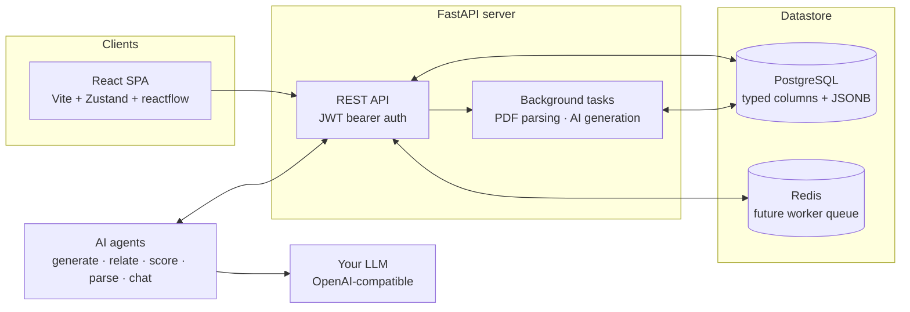

<div align="center">


# Career Assistant
### AI-guided career discovery and CV generation

**For students, career switchers and returners alike — anyone navigating a career path.**

[](https://github.com/neuronection/career-assistant/releases)
[](#scope--limitations)
[](LICENSE)
[](#quick-start)
[](https://fastapi.tiangolo.com/)
[](https://react.dev/)
[](https://www.docker.com/)

  <p>
    <small>Part of</small><br>
    <picture>
      <source media="(prefers-color-scheme: dark)" srcset="https://neuronection.com/logos/neuronection-dark.svg">
      
    </picture>&nbsp;&nbsp;&nbsp;<picture>
      <source media="(prefers-color-scheme: dark)" srcset="https://neuronection.com/logos/neuronection-wordmark-dark.svg">
      
    </picture>
  </p>

**Website**: [neuronection.com](https://neuronection.com) · **Repository**: [neuronection/career-assistant](https://github.com/neuronection/career-assistant)

</div>

> **Your data stays on your own server.** Self-hosted by design — no managed cloud.

---

## Table of contents

- [What is Career Assistant?](#what-is-career-assistant)
- [What's different](#whats-different)
- [Features](#features)
- [Structured by design](#structured-by-design)
- [Quick start](#quick-start)
  - [Install from the latest release](#install-from-the-latest-release)
  - [Run from source (developers)](#run-from-source-developers)
  - [Desktop app](#desktop-app)
- [Architecture at a glance](#architecture-at-a-glance)
- [Documentation](#documentation)
- [Tech stack](#tech-stack)
- [Scope & limitations](#scope--limitations)
- [Status & roadmap](#status--roadmap)
- [Community & support](#community--support)
- [Contributing](#contributing)
- [Security](#security)
- [License](#license)
- [Disclaimer](#disclaimer)

---

## What is Career Assistant?

A self-hosted web app that helps anyone navigate career decisions — students choosing their first path, switchers exploring adjacent roles, returners rebuilding their profile — discover which jobs actually exist, understand which ones fit their interests, personality and constraints, and find the education pathways that lead to them — with AI woven through every step.

Under the hood it's a **structured knowledge platform**: a job catalog organized as a family tree plus a typed relation graph, deep structured student profiles, and university admissions data — all referenced by stable keys, never loose labels. AI generates jobs, suggests relations, and scores matches, but every output is validated into typed structures and audited.

More than a CV builder — but the **CV Studio** is its most mature surface today: an agentic CV workspace that generates CVs from templates, from an uploaded existing CV, or on demand from your structured profile, with deep template and design customization and an AI copilot that operates the builder for you (details in the [feature catalog](docs/user/features.md#cv-studio)).

It is **beta** software, built for anyone exploring career paths and for technical self-hosters.

## What's different

- **Structure over plain text.** Everything AI produces is pydantic-validated into typed JSONB shapes and mapped onto a controlled taxonomy. Free text is allowed only as supporting `detail` — the data stays parseable and knowledge-extractable.
- **A graph, not a list.** Jobs relate through typed edges (`similar_to`, `specialises_into`, `leads_to`, `alternative_to`, `prerequisite_of`), so "what's adjacent to this?" and "what does this lead to?" are traversals, not guesswork.
- **The AI assists — it never silently decides.** Generated jobs land in a review pipeline, PDF admissions data is parsed into a reviewable draft before it touches the catalog, and every match score comes with a rationale you can read, agree or disagree with, and override with your own score.
- **Human + AI scoring.** AI scores 0–10 with positives, negatives and prerequisite checks; you score 0–10 and tag your interest status. Rankings combine both. A deterministic fit engine (inspectable, re-weightable, per-dimension) also runs without any AI at all.
- **Bring your own LLM.** Any OpenAI-compatible provider works: OpenAI, OpenRouter, a local model via Ollama or LM Studio. Configured per instance, entirely through the UI — no AI environment variables.

## Features

The short tour; the exhaustive one — including Autopilot, deep posting extraction, growth toolkit, variant library, MCP and more — lives in the [feature catalog](docs/user/features.md).

- **Explore a living job catalog** — browse job families as a tree, follow typed relations in an interactive graph, and enrich the catalog with AI-generated jobs that map onto the existing taxonomy. Search and filter across everything.
- **Build a deep, structured profile** — an onboarding wizard with start paths (answer only what applies), CV intake with review-first import, and an AI analysis of your profile. Everything is typed, so matching is computed, not vibes.
- **Get matched, with reasons** — AI scores with structured rationale (positives, negatives, missing prerequisites), your own score and interest status alongside, filterable rankings, and a side-by-side compare tray (`/compare`).
- **Find the university pathway** — upload your university's admission PDF, get a reviewable draft of universities, departments and yearly baselines, and approve every write before it lands. Degrees link to jobs through rich link rows.
- **Search live postings** — connector engines for ATS APIs, JSON-LD, RSS, CSV and paste-a-URL; a deep extraction pass turns postings into auditable skill/salary/benefit data; filter it all on the Explore page and let **Career Autopilot** hunt a goal on cadence with budgets and explainable shortlists.
- **CV Studio** — the most mature surface: a full CV workspace with a versioned template bank and design-token editor (incl. per-section containers and elevation), intake from an existing CV, one-shot AI generation from your profile with an agentic step that reads your own linked pages (GitHub repos, portfolios) and a configurable vision polish loop that can escalate a style brief to the AI template designer, an item-variant library (text and bullets-only variants), cover letters per posting, ATS lint, honest page counting, and a copilot with vision that operates the builder. Exports to PDF/DOCX/Markdown/JSON/ATS text.
- **An assistant that helps — carefully** — a chat grounded in your catalog and postings via tool-calling, profile edits proposed as review cards with before/after previews and one-click revert, interview prep, and contextual "Ask AI" buttons throughout.
- **A scheduler that works while you don't** — one periodic engine for scheduled searches, digests, source syncs and refit sweeps; on the desktop, the tray keeps it running in the background with native notifications.
- **Private and auditable** — self-hosted, encrypted AI keys at rest, and every AI call (task, model, tokens, latency) recorded in an audit trail. Production boot guards refuse weak secrets and `DEBUG=true`.

## Structured by design

Career Assistant is a student tool today, but the foundation is the same one the rest of the assistant family uses, so the same installation can grow into richer domain features — or share knowledge with its siblings — without a rewrite. You don't need to care about any of this for everyday use; it's here for when you do.

- **Taxonomy-driven everything** — interests and the skills ontology (subskills, 1–10 level anchors, aliases, proposed→active→deprecated lifecycle) are referenced by stable `key` slugs, never labels — so labels can be renamed or translated without breaking data.
- **Typed, not free-form** — skills and interests link through FK join tables (`job_skills`, `job_tags`, `user_skills`, `user_interests`), never JSONB; every AI output is pydantic-validated on write and attributed in `ai_generations`.
- **One metric language** — a dimension registry (RIASEC interest affinities, work values, work style) stores what assessments, profile sections and behavior measure, with provenance; the fit engine, filters and weight sliders all speak it.
- **Career paths as data** — curated and AI-drafted routes to each job, computed over the typed relation edges.
- **Career stages, not just students** — one stage switch retunes suggested fit weights, assessment scenarios and path ordering; presets are suggestions, never hidden scoring branches.
- **Registries as extension points** — posting sources plug in via the connector SDK, periodic work only via the scheduler, AI only via the structured-output gateway — there is no side door.
- **Dialect-aware, portable schema** — PostgreSQL (web/self-host) and SQLite (desktop) verified against one migration chain.
- **Family-compatible conventions** — same stack, settings architecture and AI configuration patterns as the other assistant-family apps.

## Quick start

### Install from the latest release

Download the installer for your platform — the links always fetch the
latest build:

| Platform | File | Link |
|---|---|---|
| Windows | `CareerAssistant-windows-x64.exe` | [download](https://github.com/neuronection/career-assistant/releases/latest/download/CareerAssistant-windows-x64.exe) |
| Linux (AppImage) | `CareerAssistant-x86_64.AppImage` | [download](https://github.com/neuronection/career-assistant/releases/latest/download/CareerAssistant-x86_64.AppImage) |
| Linux (deb) | `careerassistant_amd64.deb` | [download](https://github.com/neuronection/career-assistant/releases/latest/download/careerassistant_amd64.deb) |

All installers and older versions: [Releases](https://github.com/neuronection/career-assistant/releases/latest).

### Run from source (developers)

From a fresh clone to a running instance:

```bash
git clone https://github.com/neuronection/career-assistant.git
cd career-assistant
cp .env.example .env                                # defaults work out of the box
docker compose -f docker/docker-compose.dev-db.yml up -d   # Postgres :5433 + Redis :6380
./scripts/run-dev.sh                                # backend :8100 + frontend :3100
```

Seed the starter catalog (taxonomy + jobs + relations, idempotent):

```bash
./scripts/seed.sh
```

Open **http://localhost:3100**, register, complete the onboarding wizard, then explore the catalog, generate jobs with AI and score your matches. Interactive API docs: **http://localhost:8100/docs**.

### Desktop app

Run it as a local desktop application (pywebview window, SQLite database, everything under your OS data dir — no Docker, no Postgres):

```bash
cd backend
python -m venv venv && ./venv/bin/pip install -r requirements-desktop.txt
./venv/bin/python -m careerassistant              # window + tray (default mode)
./venv/bin/python -m careerassistant app --tray   # tray-only boot (auto-start)
./venv/bin/python -m careerassistant web          # loopback server + system browser
./venv/bin/python -m careerassistant seed         # migrations + starter catalog only
```

**Prebuilt packages** (no Python needed) are published on the
[Releases](https://github.com/neuronection/career-assistant/releases) page
for every tagged version: `.deb` + AppImage (Linux) and a portable
`CareerAssistant-windows-x64.exe` (Windows).

Closing the window keeps the app running in the tray (after a first-run
opt-in prompt) — scheduled searches, syncs and alerts continue in the
background, native toasts arrive through the desktop notification
channel, and quitting happens from the tray menu. A second launch focuses
the running window; auto-start on login is opt-in from the tray menu.

First launch creates a strong `secret.key`, applies migrations and seeds the starter catalog automatically (opt out with `CAREER_SKIP_SEED=1`). AI providers are configured in-app (Settings → AI Configuration) — for a fully local setup point a provider at Ollama (`http://localhost:11434/v1`) or LM Studio. Linux needs `libgtk-3`, `libwebkit2gtk-4.1` and an AppIndicator host (tray degrades gracefully without one).

### Prerequisites

- **Docker** and Docker Compose (for the dev database), or **Python 3.12+ / Node 18+** for the app itself.
- **An OpenAI-compatible LLM provider** (API key + endpoint) for job generation, relation suggestion, matching, PDF parsing and the chatbot. Configure it in **Settings → AI Configuration**. For offline dev you can opt into the built-in mock provider with `./scripts/run-dev.sh --mock-ai` (or `MOCK_AI=1`), so the app works fully without one.
- **PostgreSQL** — the dev compose ships one on port 5433; Redis (6380) is included for a future worker split.

## Architecture at a glance



The frontend talks to **domain endpoints** optimized for the UI: catalog (tree + graph), profile, matching, universities, chat and AI settings. All AI work runs through a single structured-output pipeline (`ainvoke_structured`): the resolved provider/model is called, the response is pydantic-validated, and the generation is audited — there is no side door around it.

PDF parsing and AI generation run as FastAPI background tasks; Redis ships in the compose file for a later worker split (no Celery in v1). Deep dive: [docs/dev/architecture.md](docs/dev/architecture.md).

## Documentation

Full manual: [docs/](docs/README.md) — split by audience into a
[user guide](docs/user/README.md) and a
[developer guide](docs/dev/README.md); navigation is described by
[docs/docs-tree.json](docs/docs-tree.json).

**Users**
- [Getting started](docs/user/getting-started.md) — install, first run, connect an AI provider
- [Feature catalog](docs/user/features.md) — everything, as built (Autopilot, extraction, CV Studio, chat, scheduler)
- [Troubleshooting](docs/user/troubleshooting.md) — common problems and fixes

**Developers & operators**
- [Architecture](docs/dev/architecture.md) — modes, runtime topology, registries, AI pipeline
- [Development workflow](docs/dev/development.md) — setup, conventions, worktrees, verification gates
- [Deployment](docs/dev/deployment.md) — self-hosting with the production compose stack, TLS, upgrades, backups
- [Contributing](CONTRIBUTING.md) — dev setup, conventions, PR checklist
- [Changelog](CHANGELOG.md) — notable changes per release

Interactive API docs are also available at `/docs` on a running backend.

## Tech stack

| Layer | Technology |
|---|---|
| Backend | FastAPI (Python 3.12+), async, SQLAlchemy 2.0 (`asyncpg`), Pydantic v2 |
| Frontend | React 18 + Vite + TypeScript (strict) + Tailwind, Zustand, reactflow, recharts |
| Database | PostgreSQL (web/self-host, typed columns + JSONB) · SQLite (desktop profile) — one portable schema |
| Cache / Queue | Redis (composed in; worker split planned) |
| Migrations | Alembic |
| AI / NLP | OpenAI-compatible providers (`base_url` override → OpenAI / OpenRouter / Ollama / LM Studio), pydantic-validated structured outputs, deterministic dev-only mock |
| Auth | JWT bearer (PyJWT) + bcrypt |
| Tests | pytest + pytest-asyncio + httpx, vitest + testing-library, ruff |
| Container | Docker + Docker Compose (dev database) |

## Scope & limitations

Career Assistant is in **public beta** (`0.10.x`). The points below are honest boundaries — not every limitation is a bug.

- **Pre-1.0 APIs.** REST endpoints and DB schemas may change before `1.0`. Pin a version if you depend on it.
- **Single-container scale.** One uvicorn process serves the API and the built SPA (see [Deployment](docs/dev/deployment.md)); there is no horizontal-scaling story yet. A worker split is on the roadmap.
- **No Celery in v1.** PDF parsing and AI generation run as in-process FastAPI background tasks. Redis ships in the compose file for a later worker split; today the FastAPI process does the work itself.
- **Single-tenant.** Students are `users`; there is no tenancy model. Multi-school/organization support is not on the v1 roadmap.
- **AI features need a configured provider in production.** A fresh production install starts unconfigured and AI endpoints answer 503 until an admin sets a provider up in the UI. The mock provider can never serve results in production.
- **University intake is manual-review.** PDF parsing extracts a draft; it is not an official data feed and should always be reviewed against the source document.
- **No career-counseling certification.** This software is informational; it does not replace professional career or academic guidance (see [Disclaimer](#disclaimer)).

## Status & roadmap

**Recently shipped** (full story in [CHANGELOG.md](CHANGELOG.md)):

- **CV Studio waves** — one-shot generation from your profile with a vision polish loop; the variant library; chat CV references with a builder-copilot handoff; template previews with your own data; grounded chat edits with one-click revert.
- **Discovery wave** — skills ontology, deterministic fit engine, JobTypeMatch assessment, engagement & notifications, career stages.
- **Live postings wave** — connector SDK (ATS/JSON-LD/RSS/CSV/URL), deep extraction with skill-level search, Explore page, Career Autopilot, express start & target mode, growth toolkit, the modular scheduler.
- **Desktop & ops** — tray background mode, Linux packaging (`.deb` + `.AppImage`), production self-host stack ([docs/dev/deployment.md](docs/dev/deployment.md)), MCP server + client bridge, semantic search & skill packs, interview prep.

**Up next**:

- Notification-center library unification and health-assistant adoption — shared work in the assistant-ui and health repos.
- Pending rescope: match staleness/bulk re-score, E2E + typing gates, broader i18n coverage, demand-history trends; sustainability model.

## Community & support

Questions: [Discord](https://discord.com/invite/SZCXNTwv) ·
Bugs & feature requests: [Issues](https://github.com/neuronection/career-assistant/issues) ·
Support development: [Buy Me a Coffee](https://buymeacoffee.com/neuronection)

## Contributing

Contributions are welcome. To set up a working dev environment, follow [Quick start](#quick-start) and read [CONTRIBUTING.md](CONTRIBUTING.md) for code style, testing and the PR checklist.

For backend changes, run `ruff check` / `ruff format --check` and the pytest suite before submitting. For frontend changes, `npm run build`, `npm run test -- --run` and `npm run lint` must pass. Security issues go through [SECURITY.md](SECURITY.md), never public issues.

## Security

Found a vulnerability? Do not open a public issue — see
[SECURITY.md](SECURITY.md) for the private disclosure process.

<!-- NEURONECTION:ECOSYSTEM:START -->
---

<div align="center">

### Part of the Neuronection family

**Career Assistant** is one of four connected, open-source (Apache-2.0) AI assistants
for life's big decisions — structured data instead of text dumps, AI that explains
its reasoning, and you in control of your information.

<table>
  <tr>
    <td width="50%" align="center" valign="top">
      <picture>
        <source media="(prefers-color-scheme: dark)" srcset="https://neuronection.com/logos/health-light.svg">
        
      </picture>
      <br>
      <a href="https://neuronection.com/en/health/"><strong>Health Assistant</strong></a>
      <br><sub>Self-hosted, privacy-first health records — lab results, biomarkers, documents and AI-powered insights into your own data.</sub>
      <br><sub><a href="https://github.com/health-assistant-io/health-assistant">GitHub</a> · <a href="https://health-assistant.io">health-assistant.io</a></sub>
    </td>
    <td width="50%" align="center" valign="top">
      <picture>
        <source media="(prefers-color-scheme: dark)" srcset="https://neuronection.com/logos/career-light.svg">
        
      </picture>
      <br>
      <a href="https://neuronection.com/en/career/"><strong>Career Assistant</strong> <sub>· this repo</sub></a>
      <br><sub>A mapped universe of jobs — family tree + relation graph, AI match scoring and university pathways, built for students deciding their future.</sub>
      <br><sub><a href="https://github.com/neuronection/career-assistant">GitHub</a> · <a href="https://github.com/neuronection/career-assistant/tree/main/docs">Docs</a></sub>
    </td>
  </tr>
  <tr>
    <td width="50%" align="center" valign="top">
      
      <br>
      <a href="https://neuronection.com/en/study/"><strong>Study Assistant</strong></a>
      <br><sub>A local-first study workbench, in browser or on desktop — AI-powered course library, handwriting, chat and practice; math-first, subject-agnostic.</sub>
      <br><sub><a href="https://github.com/neuronection/study-assistant">GitHub</a> · <a href="https://github.com/neuronection/study-assistant/tree/main/docs">Docs</a></sub>
    </td>
    <td width="50%" align="center" valign="top">
      
      <br>
      <a href="https://neuronection.com/en/desktop/"><strong>Desktop Assistant</strong></a>
      <br><sub>A system-tray AI launcher for Windows, Linux and macOS — global hotkey, streaming chat, voice input, attachments; local-only history.</sub>
      <br><sub><a href="https://github.com/neuronection/desktop-assistant">GitHub</a> · <a href="https://github.com/neuronection/desktop-assistant/tree/main/docs">Docs</a></sub>
    </td>
  </tr>
</table>

Created and maintained by [Ilias Chatzopoulos](https://github.com/constLiakos)
· [LinkedIn](https://www.linkedin.com/in/ilias-chatzopoulos-aabb22163/)
· [info@neuronection.com](mailto:info@neuronection.com)

[neuronection.com](https://neuronection.com) — one ecosystem, four guides
· [♥ Support development](https://buymeacoffee.com/neuronection) · star what you use

</div>
<!-- NEURONECTION:ECOSYSTEM:END -->

## License

Apache License 2.0 — see [LICENSE](LICENSE). © 2026 constLiakos.

## Disclaimer

This software, including its AI chatbot and agentic features that may offer career-related information, guidance, or job and education explanations, is for informational purposes only. It does **not** provide professional career counseling and is not a substitute for qualified academic advisors, career counselors, or official university admissions offices. Always verify admission baselines and program requirements against official sources before making education or career decisions based on the software's output.
