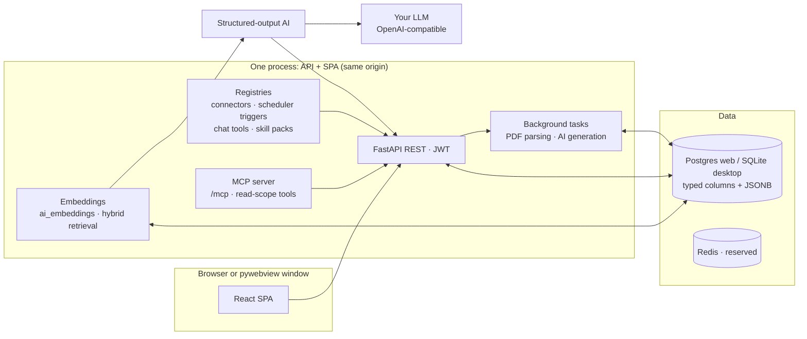

# Architecture

Career Assistant is a **dual-mode product**: a self-hosted web platform
(Postgres, Docker) and a local desktop app (pywebview + SQLite). Both modes
are first-class, CI-covered, and share one codebase — the schema is
dialect-aware (Postgres + SQLite verified) and neither mode may break the
other.

## Repo map

```
├── backend/
│   ├── app/            # FastAPI: api/, services/, models, ai/, connectors/
│   ├── alembic/        # migrations (dialect-aware)
│   ├── careerassistant/  # desktop entrypoint (python -m careerassistant)
│   ├── tests/          # pytest (async; career_test DB)
│   └── venv/           # dev virtualenv (PEP 668: never system Python)
├── frontend/           # React 18 + Vite + TS + Tailwind + Zustand SPA
├── docker/             # compose taxonomy + Dockerfile + nginx confs
├── packaging/          # PyInstaller spec, deb/AppImage/Windows build scripts
├── scripts/            # run-dev.sh, ops + test + seed scripts, dev lib
└── assets/             # canonical brand assets
```

## Runtime topology



The frontend talks to **domain endpoints** optimized for the UI (catalog
tree + graph, profile, matching, universities, chat, AI settings). All AI
work runs through one structured-output pipeline (`ainvoke_structured` in
the gateway, `app/ai/gateway.py`): resolved provider → LangChain chat
model (`app/ai/chat_models.py` is the only module that touches provider
SDKs) → pydantic-validated response → audited row in `ai_generations`.
There is no side door around it.

## Extension points are registries

- **Posting sources** only via the connector SDK (`app/connectors/`,
  entry-point group `career_assistant.connectors`, admin allowlist).
- **Periodic work** only via the scheduler (`app/services/scheduler/`;
  triggers via `career_assistant.scheduler_triggers`). The scheduler decides
  WHEN and only enqueues jobs.
- **Notifications** always flow through `NotificationService.emit` (single
  funnel; alert rules and their triggers live on `EngagementService`).
- **CV context sources** register in
  `app/services/cv_context_service.py` (`register_context_source`): each
  source binds a profile entity to a typed resolver; selection resolves
  deterministically into the renderer snapshot with per-item traceability.
  Ineligible profile data is not registered — it cannot reach a CV.
- **CV block kinds** register in `app/services/cv_blocks.py`
  (`register_block_kind`): a kind binds a props schema + renderer
  behavior; cover letters reuse the pipeline through the `letter` kind.
- **Metric dimensions** are a curated registry
  (`metric_dimensions` table, code spec in `app/seeds/metrics.py`):
  `user_metric_profile` stores measured values with provenance; the fit
  engine, filters and weight sliders read the same dimension keys.
- **The extraction feature map** lives in
  `app/services/feature_map.py`: rows bind every `PostingExtract` field
  to its real consumers, and the AI extraction prompt is generated from
  those rows — schema and prompt cannot drift.
- **Chat tools** register in `app/ai/tools/` (`AITool` data,
  single `run_tool` executor, entry-point group `career_assistant.tools`
  gated by `TOOL_PLUGINS_ALLOWLIST`). The autopilot's `run_autopilot` /
  `my_autopilot` are registry members with the `chat` audience; the CV
  builder copilot's `cv_*` operations are members with the
  `cv_builder` audience — read-scope state/visual-review plus write-scope
  builder mutations, all executing the same `cv_builder_chat` agent
  functions the turn loop uses.
- **Skill packs** are versioned instruction data in
  `ai_skill_packs` (37-style immutable versions; bank seeds in
  `app/seeds/skill_packs.py`). `app/ai/packs.py` resolves the latest
  published bank pack per task; the gateway appends it to the system
  prompt and pins `pack_key`/`pack_version` on every `ai_generations`
  row. Packs steer tone/structure only — validators are untouched.
- **MCP surfaces** live in the AI layer:
  `app/ai/mcp_server.py` exposes the registry's **read-scope tools
  only** over Streamable HTTP at `/mcp` (FastMCP; token persisted in
  the data dir, live admin rotation `POST /ai/mcp/token`; per-host
  rate limiting via `MCP_RATE_LIMIT`). The client bridge
  (`app/services/mcp_bridge_service.py` + `ai_mcp_servers`) keeps
  registration/discovery/allowlist; protocol plumbing stays in
  `app/ai/mcp_client.py` (alignment R2). Bridge invocations are audited
  + budgeted as `mcp_tool_call`.
- **Embeddings** flow through the `embed` task
  (EMBEDDINGS capability) into `ai_embeddings` (`app/models/
  embedding_model.py`, `app/services/embedding_service.py`) — packed
  JSONB vectors are the single source of truth on every dialect;
  pgvector is provisioned best-effort, never required. Hybrid retrieval
  (`app/services/hybrid_search.py`) RRF-fuses lexical + cosine rankings
  over the hard-filtered candidate set in explore's relevance sort —
  semantic is a ranking signal, never a filter gate.
- **Follow-up automation** is a scheduler slot
  (`system_followups` → `followup_sweep` job,
  `app/services/followups_service.py`): a stateless sweep over applied
  `posting_interactions` (+7d/+14d nudges, interview/offer check-ins)
  emitting through the notification funnel; sent-state lives in
  notification dedup keys, prefs in `preferences["followups"]`
  (`GET/PATCH /me/followups`).

## AI flows are LangGraph graphs

Multi-step AI flows are checkpointed LangGraph
`StateGraph`s under `app/ai/graphs/`. Nodes make one gateway
call or do deterministic work; the checkpointer is app-lifespan-owned
(`app/ai/checkpointer.py`: AsyncPostgresSaver web / AsyncSqliteSaver
desktop) and `thread_id` is the run id, so an interrupted run resumes
from its last completed node via `ainvoke(None, config)`. Long runs
execute on the job queue (`autopilot_run` job type,
`user_autopilot` schedule slot); the scheduler only enqueues.

Chat-bound flows stay on bounded structured turns instead of graphs when
each turn is a single gateway call (rule: don't graph-ify single-call
tasks): the CV builder copilot and the interview practice loop
 ride the standard chat turn with a `context.surface` branch;
their durable state lives in app tables (`cv_documents` working content /
`interview_sessions` plan + rubric), and resumability comes from the chat
transcript itself.

PDF parsing and AI generation run as FastAPI background tasks; Redis ships
in the compose file for a later worker split (no Celery in v1).

## AI configuration is data, not env

AI providers/models/task assignments live exclusively in the database
(Settings → AI Configuration). There are deliberately no `AI_*` env vars.
Production starts unconfigured (AI endpoints answer `503` until an admin
adds a provider); in `APP_ENV=development` a mock provider is auto-provisioned
so the app works without keys.

## Modes & data

| Mode | DB | Shell | Packaging |
|---|---|---|---|
| Web / self-host | Postgres 16 (JSONB) | Browser | `docker/` compose stacks (single image serving API + SPA) |
| Desktop | SQLite (aiosqlite) | pywebview window + tray | PyInstaller → deb / AppImage / Windows exe |

Desktop data lives under the OS data dir; first launch creates a strong
`secret.key`, migrates and (optionally) seeds. Closing the window keeps the
app in the tray — scheduled work continues in-process.

## Dev loop & deployment

- Dev: `docker compose -f docker/docker-compose.dev-db.yml up -d` then
  `./scripts/run-dev.sh` (honcho: backend :8100 + vite :3100).
- Deploy: `docker/docker-compose.standalone.yml` (app + Postgres + nginx,
  TLS-ready) or `prod.yml` behind your own LB — see [deploy.md](deploy.md).
- Verification gates: backend pytest + ruff; frontend build + vitest
  (`AGENTS.md` has the exact commands).
