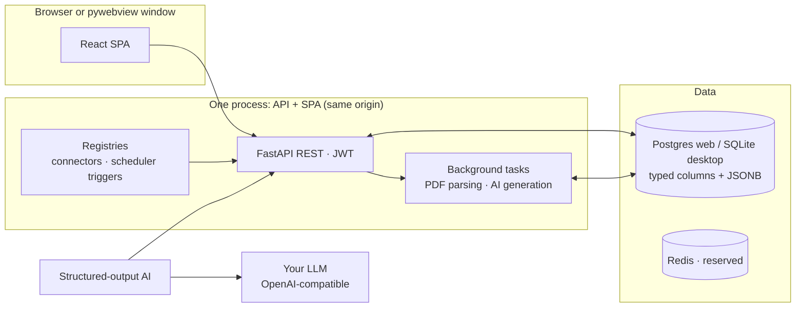

# Architecture

Career Assistant is a **dual-mode product**: a self-hosted web platform
(Postgres, Docker) and a local desktop app (pywebview + SQLite). Both modes
are first-class, CI-covered, and share one codebase — the schema is
dialect-aware (Postgres + SQLite verified) and neither mode may break the
other.

## Repo map

```
├── backend/
│   ├── app/            # FastAPI: api/, services/, models, ai/, connectors/
│   ├── alembic/        # migrations (dialect-aware)
│   ├── careerassistant/  # desktop entrypoint (python -m careerassistant)
│   ├── tests/          # pytest (async; career_test DB)
│   └── venv/           # dev virtualenv (PEP 668: never system Python)
├── frontend/           # React 18 + Vite + TS + Tailwind + Zustand SPA
├── docker/             # compose taxonomy + Dockerfile + nginx confs
├── packaging/          # PyInstaller spec, deb/AppImage/Windows build scripts
├── scripts/            # run-dev.sh, ops + test + seed scripts, dev lib
└── assets/             # canonical brand assets
```

## Runtime topology



The frontend talks to **domain endpoints** optimized for the UI (catalog
tree + graph, profile, matching, universities, chat, AI settings). All AI
work runs through one structured-output pipeline (`ainvoke_structured`):
resolved provider → pydantic-validated response → audited row in
`ai_generations`. There is no side door around it.

## Extension points are registries

- **Posting sources** only via the connector SDK (`app/connectors/`,
  entry-point group `career_assistant.connectors`, admin allowlist).
- **Periodic work** only via the scheduler (`app/services/scheduler/`;
  triggers via `career_assistant.scheduler_triggers`). The scheduler decides
  WHEN and only enqueues jobs.
- **Notifications** always flow through `NotificationService.emit` (single
  funnel; alert rules and their triggers live on `EngagementService`).

PDF parsing and AI generation run as FastAPI background tasks; Redis ships
in the compose file for a later worker split (no Celery in v1).

## AI configuration is data, not env

AI providers/models/task assignments live exclusively in the database
(Settings → AI Configuration). There are deliberately no `AI_*` env vars.
Production starts unconfigured (AI endpoints answer `503` until an admin
adds a provider); in `APP_ENV=development` a mock provider is auto-provisioned
so the app works without keys.

## Modes & data

| Mode | DB | Shell | Packaging |
|---|---|---|---|
| Web / self-host | Postgres 16 (JSONB) | Browser | `docker/` compose stacks (single image serving API + SPA) |
| Desktop | SQLite (aiosqlite) | pywebview window + tray | PyInstaller → deb / AppImage / Windows exe |

Desktop data lives under the OS data dir; first launch creates a strong
`secret.key`, migrates and (optionally) seeds. Closing the window keeps the
app in the tray — scheduled work continues in-process.

## Dev loop & deployment

- Dev: `docker compose -f docker/docker-compose.dev-db.yml up -d` then
  `./scripts/run-dev.sh` (honcho: backend :8100 + vite :3100).
- Deploy: `docker/docker-compose.standalone.yml` (app + Postgres + nginx,
  TLS-ready) or `prod.yml` behind your own LB — see [deploy.md](deploy.md).
- Verification gates: backend pytest + ruff; frontend build + vitest
  (`AGENTS.md` has the exact commands).
