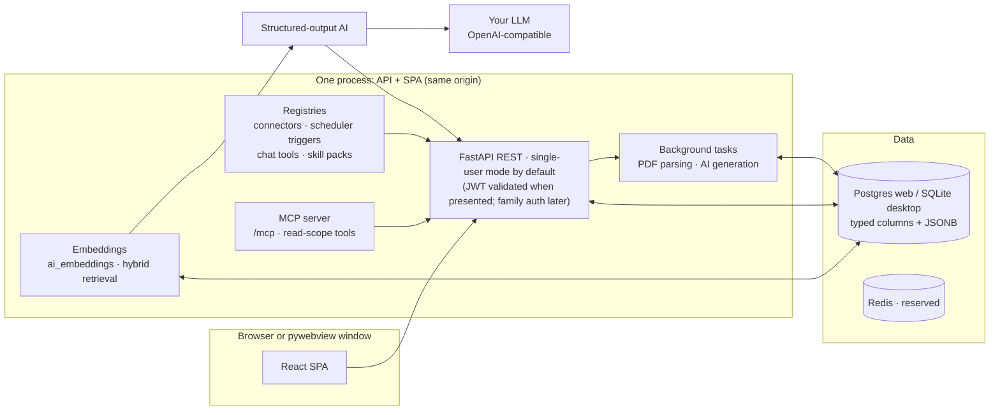

# Architecture

Career Assistant is a **dual-mode product**: a self-hosted web platform
(Postgres, Docker) and a local desktop app (pywebview + SQLite). Both modes
are first-class, CI-covered, and share one codebase — the schema is
dialect-aware (Postgres + SQLite verified) and neither mode may break the
other.

## Repo map

```
├── backend/
│   ├── app/            # FastAPI: api/, services/, models, ai/, connectors/
│   ├── alembic/        # migrations (dialect-aware)
│   ├── careerassistant/  # desktop entrypoint (python -m careerassistant)
│   ├── tests/          # pytest (async; career_test DB)
│   └── venv/           # dev virtualenv (PEP 668: never system Python)
├── frontend/           # React 18 + Vite + TS + Tailwind + Zustand SPA
├── docker/             # compose taxonomy + Dockerfile + nginx confs
├── packaging/          # PyInstaller spec, deb/AppImage/Windows build scripts
├── scripts/            # run-dev.sh, ops + test + seed scripts, dev lib
└── assets/             # canonical brand assets
```

## Runtime topology



The frontend talks to **domain endpoints** optimized for the UI (catalog
tree + graph, profile, matching, universities, chat, AI settings). All AI
work runs through one structured-output pipeline (`ainvoke_structured` in
the gateway, `app/ai/gateway.py`): resolved provider → LangChain chat
model (`app/ai/chat_models.py` is the only module that touches provider
SDKs) → pydantic-validated response → audited row in `ai_generations`.
There is no side door around it.

## Extension points are registries

- **Posting sources** only via the connector SDK (`app/connectors/`,
  entry-point group `career_assistant.connectors`, admin allowlist).
- **Periodic work** only via the scheduler (`app/services/scheduler/`;
  triggers via `career_assistant.scheduler_triggers`). The scheduler decides
  WHEN and only enqueues jobs.
- **Notifications** always flow through `NotificationService.emit` (single
  funnel; alert rules and their triggers live on `EngagementService`).
- **CV context sources** register in
  `app/services/cv_context_service.py` (`register_context_source`): each
  source binds a profile entity to a typed resolver; selection resolves
  deterministically into the renderer snapshot with per-item traceability.
  Ineligible profile data is not registered — it cannot reach a CV.
  The experience table splits into three sources (plan 70): `experience`
  resolves paid work only (jobs, internships, freelance), `projects`
  kind=project, `volunteer` kind=volunteer — keeping the generate
  machinery's `section kind == source_key` invariant, so generated CVs
  emit separate Work Experience / Projects / Volunteering sections.
- **Synthesized CV variants** (plan 62) live in the user-level
  `cv_synth_items` library (`app/services/cv_synth_service.py`), not in
  the profile: each variant cites typed source refs + source content
  hashes (staleness/orphan detection) and applies through the per-CV
  `context.synth_mode` overlay BEFORE editor overrides — precedence is
  override > synth > source, every application traced via
  `synth_applied` in the version's `context_resolution`. AI variant
  drafts go through the `cv_synth` gateway task; the CV copilot tools
  (`cv_synth_*`) are registry tools whose read scope surfaces in /mcp.
  One-shot generation is synth-aware (plan 69): in `prefer` mode the
  draft graph's `collect` node applies the same overlay before drafting
  (matching via `match_for_user`, no `CvDocument` needed), and the plan
  node may propose ≤3 gap variants per run — grounded by the
  deterministic `synthesize` node as DRAFT rows whose text feeds the
  draft (never editor overrides); the run result records
  `synth_applied`/`synth_proposed` and `POST /cv/synth/preview` powers
  the modal's pre-run match hint. The main chat can manage variant
  defaults too (plan 104): the chat-audience `variant_list`/`variant_pin`
  registry tools list the library and set/unset the per-item pin on an
  attached CV (a pinned draft promotes first — `pin inactive` stays
  unreachable).
- **Synth maturity in CV Studio** (plan 72): the builder context panel
  renders the variant library as a synth tree under its sources
  (cross-listed per touched source, stale/orphan badges, status toggles
  with the one-variant-window supersede hint of `_supersede_slot`);
  manual variants are first-class — `POST /cv/synth` writes live
  variants through the shared `VariantEditor` (library page + builder
  context entry; language and posting scope recorded at creation, not
  editable after). The `synth` snapshot key is computed per CV in
  `CvBuilderService.resolution` (language + posting match via
  `match_for_user`, winner per ref, deduped to one entry per variant,
  excluded when already overlay-applied in `prefer` mode — never
  double-rendered) and consumed by the `synth_items` block kind
  ("Custom highlights": `title`, `selected` variant ids — empty =
  all applicable, `show_source_chips` prints the referenced items,
  `max_items`); markdown/ATS/DOCX exports branch on the kind via
  `_visible_blocks`. Item ordering is a JSONB block prop
  (`ItemsBlockProps.order`: ordered ids first, remainder in resolved
  order) applied by the renderer after its filters and before
  `max_items` truncation — the editor persists the full id array from
  the SectionsPanel reorder disclosure; `snapshot` rows carry their
  context item id (stamped in `resolution`) to make `order` robust
  against removed items.
- **CV block kinds** register in `app/services/cv_blocks.py`
  (`register_block_kind`): a kind binds a props schema + renderer
  behavior; blocks carry an `area` mark (`main`/`sidebar`, legacy
  `column` accepted) that sidebar layouts honor when grouping columns
  (a `header` block may live in either column — the sidebar column
  inherits its text color for name/photo/contact, and skill bars/
  contact pieces switch to `currentColor` mixes for contrast). Cover
  letters reuse the pipeline through the `letter` kind. Design tokens
  include per-area paddings (plan 70): `main_padding_mm` /
  `sidebar_padding_mm` (unset = legacy defaults); sidebar templates pair
  them with `margin_mm: 0` so each area owns its spacing instead of the
  page; `header_style: "band"` paints the name/contact header as a
  filled accent panel. The bank (`app/seeds/cv_templates.py`) ships
  photo + skill-bar magazine layouts (`coral-banner`, `charcoal-amber`)
  alongside the classic/sidebar rows. Plan 79.1 token additions (all
  additive, default = today's rendering): real `grouped` skills
  categories with `.skill-cat` subheadings, `show_heading_icons` +
  per-block `icon` (NULL = kind default, `""` = clear; glyphs from
  `cv_icons.SECTION_KIND_ICONS`), `photo_shape: "arch"`,
  `name_style: "accent_surname"` (a lighter tint wins inside band
  headers), `main_columns`/`sidebar_columns` newspaper flow (CSS
  multi-column; the overflow estimator halves the column share), and
  `font_stack: "embedded-sans" / "embedded-serif"` — vendored OFL WOFF2
  subsets inlined as data URIs by `cv_fonts.py` (files missing ⇒ the
  system stack trails, capability-detected).
- **CV polish loop** (plan 64) rides the same `cv_generate` background
  job after the `cv_draft` assemble node: the `cv_build_review` vision
  task (`app/ai/agents/cv_build_reviewer.py`) critiques the rendered
  pages + lint + a deterministic coverage matrix
  (`cv_context_service.build_coverage_matrix`), and a bounded
  fix/applicant node applies its `BuilderOp` suggestions through
  `cv_builder_chat.apply_operation` (same audited path as the
  copilot; op validation failures are logged and dropped). Design
  edits materialize as new template versions
  (`_styled_template` → `new_version`); variants ground through the
  `cv_synth` task and are kept (DRAFT row in `cv_synth_items`) or
  reverted by the next review. The polish trace lives on the final
  `ai_apply` version payload (`content["polish"]`) and in the job
  result — never in `working_content` (the builder replaces that
  dict).
- **UI-driven builder ops** (plan 71): `POST /cv/{id}/ops` applies the
  same `BuilderOp` vocabulary through `cv_builder_chat.apply_operation`
  — buttons and the copilot converge on one audited code path (bank
  templates auto-customize to a private copy; every response carries
  the refreshed state incl. the effective `template_id`). The builder's
  Template tab (`GET /cv/{id}/design` for initial state) exposes the
  full `DesignTokens` editor plus printed-page visual review
  (`POST /cv/templates/{id}/visual-review`), and the copilot's
  structured critique renders in the AI tab with one-click
  `safe_token_fixes` apply.
- **Language-display registries** live in `app/services/cv_languages.py`:
  ISO code → human name (30 languages, on-demand values render via
  title-cased fallback when the extraction/combobox vocabulary grows),
  profile level → representative CEFR band, and
  the proficiency-exam vocabulary that lets the `languages` block claim
  the latest matching certification inline (with
  `exclude_proficiency` dedupe on the certifications `items` block,
  plus an explicit `language_code` on certifications outranking the
  derived matcher). Templates select presentation props only; the merge
  logic is shared.
- **Metric dimensions** are a curated registry
  (`metric_dimensions` table, code spec in `app/seeds/metrics.py`):
  `user_metric_profile` stores measured values with provenance; the fit
  engine, filters and weight sliders read the same dimension keys.
- **The extraction feature map** lives in
  `app/services/feature_map.py`: rows bind every `PostingExtract` field
  to its real consumers, and the AI extraction prompt is generated from
  those rows — schema and prompt cannot drift.
- **CV pagination is estimated, then measured — the printed PDF is the
  truth**: `cv_renderer` computes `estimated_pages` from per-column wrap
  math (font size, page size, sidebar width all factor in) and honors
  them per column (two-column layouts fill max(main, sidebar) pages —
  the columns table-based so they fragment across print pages). Whenever
  the engine is reachable, `cv_pdf_service.measure_pages` prints the
  document once through the persistent headless-Chromium browser, counts
  the PDF's own page tree via pypdfium2 (never clamped) and rasterizes
  the exact printed pages for the vision critique; lint prefers that
  live print over the last export's stamp (`page_count_source` says
  which) and PDF exports stamp it onto the compiled version
  (`content.render.pages_actual`). Linux desktop packages bundle the
  Chromium headless shell, the Windows exe falls back to the system
  Edge/Chrome channels, and `careerassistant enginecheck` probes a
  frozen install; break-quality is CSS-only (`break-inside: avoid` on
  semantic units, `break-after: avoid` on headings).
- **Chat tools** register in `app/ai/tools/` (`AITool` data,
  single `run_tool` executor, entry-point group `career_assistant.tools`
  gated by `TOOL_PLUGINS_ALLOWLIST`). The autopilot's `run_autopilot` /
  `my_autopilot` are registry members with the `chat` audience; the CV
  builder copilot's `cv_*` operations are members with the
  `cv_builder` audience — read-scope state/visual-review plus write-scope
  builder mutations, all executing the same `cv_builder_chat` agent
  functions the turn loop uses.
- **Web tools** (plan 80) `web_search` / `fetch_url` / `github_repo` are
  read-scope members with the `chat` + `mcp` audiences. `fetch_url`
  guards outbound requests (resolve-then-connect SSRF blocklist, manual
  redirect hops, size/time caps) and reduces HTML to text; JS-shell pages
  escalate to the plan-76 persistent browser when present. `web_search`
  calls the user-hosted SearXNG instance
  (`web.searxng_url` in `app_settings`, never bundled; probe status
  `ok/unreachable/json_disabled`, and the tool answers its absence
  gracefully). `github_repo` uses the GitHub REST API with an optional
  Fernet-encrypted token (`web.github_token`). Fetched content is
  untrusted: capped and wrapped as reference data in the prompt, never
  treated as instructions.
- **Skill packs** are versioned instruction data in
  `ai_skill_packs` (37-style immutable versions; bank seeds in
  `app/seeds/skill_packs.py`). `app/ai/packs.py` resolves the latest
  published bank pack per task; the gateway appends it to the system
  prompt and pins `pack_key`/`pack_version` on every `ai_generations`
  row. Packs steer tone/structure only — validators are untouched.
- **Run linkage**: multi-step flows (CV generation, the polish loop) opt
  each gateway call into the audit ledger with a `RunRef` (run id =
  background-job id, stage label) — `ai_generations.run_id`/`run_stage`
  are plain nullable indexed columns (no FK), so the ledger outlives the
  run and single-call/sync paths stay indistinguishable from before
  (NULL columns, byte-identical behavior). The mid-run job mirror
  (`job.result.polish.llm_calls`) and the finalized polish trace carry
  the run's compact call ledger; an opt-in `with_audit_ref` on the
  gateway returns the audit row just written without a second SELECT.
  `GET /cv/{id}/runs` assembles per-CV runs (generation + every polish
  re-run) from the job rows and their run-linked audit rows — the
  builder's "Runs & metrics" popup (65.5) reads this, not a new ledger.
  The presentation layer is the family library `flow-trace` module
  (`FlowTraceCard` + `FlowTelemetryStrip`, schema-owned, zero app data
  joins); mock-provider rows badge as simulated, never fake spend.
- **MCP surfaces** live in the AI layer:
  `app/ai/mcp_server.py` exposes the registry's **read-scope tools
  only** over Streamable HTTP at `/mcp` (FastMCP; token persisted in
  the data dir, live admin rotation `POST /ai/mcp/token`; per-host
  rate limiting via `MCP_RATE_LIMIT`). The client bridge
  (`app/services/mcp_bridge_service.py` + `ai_mcp_servers`) keeps
  registration/discovery/allowlist; protocol plumbing stays in
  `app/ai/mcp_client.py` (alignment R2). Bridge invocations are audited
  + budgeted as `mcp_tool_call`.
- **Embeddings** flow through the `embed` task
  (EMBEDDINGS capability) into `ai_embeddings` (`app/models/
  embedding_model.py`, `app/services/embedding_service.py`) — packed
  JSONB vectors are the single source of truth on every dialect;
  pgvector is provisioned best-effort, never required. Hybrid retrieval
  (`app/services/hybrid_search.py`) RRF-fuses lexical + cosine rankings
  over the hard-filtered candidate set in explore's relevance sort —
  semantic is a ranking signal, never a filter gate.
- **Follow-up automation** is a scheduler slot
  (`system_followups` → `followup_sweep` job,
  `app/services/followups_service.py`): a stateless sweep over applied
  `posting_interactions` (+7d/+14d nudges, interview/offer check-ins)
  emitting through the notification funnel; sent-state lives in
  notification dedup keys, prefs in `preferences["followups"]`
  (`GET/PATCH /me/followups`).

## AI flows are LangGraph graphs

Multi-step AI flows are checkpointed LangGraph
`StateGraph`s under `app/ai/graphs/`. Nodes make one gateway
call or do deterministic work; the checkpointer is app-lifespan-owned
(`app/ai/checkpointer.py`: AsyncPostgresSaver web / AsyncSqliteSaver
desktop) and `thread_id` is the run id, so an interrupted run resumes
from its last completed node via `ainvoke(None, config)`. Long runs
execute on the job queue (`autopilot_run` job type,
`user_autopilot` schedule slot); the scheduler only enqueues.

The **main chat turn is itself a checkpointed graph** (ADR-0016,
`app/ai/graphs/chat_turn.py`): `retrieve` (code-owned detections +
registry tools, digest cache) → `agent_round ⇄ execute_tools` (the model
calls registry tools itself through the audited gateway funnel, bounded
rounds + per-turn tool budgets, digest results persist into the session
cache) → `synth` (the structured streaming reply) → `hitl` (proposal
cards + notification fanout, never auto-applied) → `finalize`
(persistence + terminal events). Events stream through a queue into the
SSE endpoint (contract unchanged); a provider that cannot call tools
degrades to prompt-stuffed digests (worst case = the pre-graph
behavior). Remaining chat-bound flows stay on bounded structured turns
when each turn is a single gateway call (rule: don't graph-ify
single-call tasks): the CV builder copilot and the interview practice
loop ride the standard chat turn with a `context.surface` branch;
their durable state lives in app tables (`cv_documents` working content /
`interview_sessions` plan + rubric), and resumability comes from the chat
transcript itself. Checkpoint retention: the desktop prunes its SQLite
`checkpoints.db` at boot (`CHECKPOINT_TTL_DAYS`); the server prunes
Postgres on the daily `system_checkpoint_prune` schedule
(`checkpoint_prune` job).

Both paths surface a shared **turn trace** to the user: the stream emits
family `tool_call` events (snake_case `duration_ms` on the wire) while
the phase/node events run, and the same data persists into the assistant
message's `metadata_json` as `tools[]` (execution windows +
capped `args_summary`/`result_summary`) and `nodes[]` (per-phase
`start_ms`/`duration_ms`) — the schema is JSONB dialect-safe and needs
no migration. For the builder copilot the trace is honest-by-construction:
the one structured planning LLM call stays a node (no synthetic tools),
the real work (state read, operations, visual review) shows as tool
cards, and an error turn records the node windows it reached before
failing. Plan 104 closes the loop to the Studio: a chat-side mutation
(approved/reverted HITL card, finished write-scope tool) bumps a
`dataRevision` counter on the `cvBuilderLinkStore`, and the mounted CV
Builder debounces it into a preview/meta/synth refetch — the open page
tracks the resolved CV without a manual reload.

**Chat-proposed profile mutations are HITL proposals, never
auto-applied** (plan 77): the chatbot emits typed ops that land in
`profile_proposals` (kind/action/payload reusing the REST schemas,
field-level `diff_json`, `base_updated_at` for conflict detection, full
entity snapshots for deletes) as pending cards resolved via idempotent
`approve`/`reject` endpoints — detached cards + events, deliberately not
`interrupt()` (interrupts pause a whole graph and cannot serve
multi-card turns). Applying dispatches to the same services the REST
forms use; cards are first-class rows (SET NULL chat lineage, 14-day
TTL swept daily by the `system_proposal_sweep` schedule slot,
`ProfileProposalService`). The chat surfaces render the cards
(library `chat-hitl` module) and the Profile sidebar entry badges the
pending count.

**Plan 99 — grounded profile editing** hardens that flow
structurally: a **server-side read-before-edit gate** (the model must
open an item's full content with the `read_profile_item` /
`read_profile_section` registry tools — digests truncate at 140 chars —
before proposing a change to it; ops on unread targets drop with a
visible `unread_target` reason; reads persist freshness-signed in the
session digest cache). Edit ops carry **anchored, granular
instructions** (`text_edits`: unique-anchor `replace`, additive
`append`/`prepend`, resolved sequentially against the RAW stored text;
`collection_edits` adding/removing children matched by stable id —
full-replacement of child collections inside an update payload is
retired, a second op on the same entity drops `duplicate_target`).
On edit-intent turns a **pre-stream self-healing pipeline**
(`retrieve → agent_round ⇄ tools → ops_draft [→ one repair] → synth →
hitl`) drafts, validates and repairs the ops against the grounding with
verbatim error feedback BEFORE the answer streams (validated ops ride
turn state, degrade providers fall back to the merged reply ops under a
relaxed gate); outcomes land in `profile_op_outcomes` telemetry. Cards
show **lossless diffs** (2000-char values, structured collection rows,
per-edit summary rows), an op-preview request (lazy snapshot endpoint
`{before, after, edits}` over the persisted KIND_SPECS-shaped
`base_snapshot`/`after_snapshot`) renders the real item card before and
after with the changed span highlighted, and an approved card can be
**reverted in one click** through the same services (terminal
`reverted` status; a moved-target guard 409s when the entity changed
after the apply). Edit-before-approve card UX is plan 100.

**Plan 101 — every proposal kind renders like its edit surface**: the
cv_synth variant card resolves each context ref to a human label at
card creation (`resolved_refs` in `payload_json`; abbreviated
title `Add CV variants · <primary label> (+N) · <action>`, unreadable
refs degrade to "Unknown item", posting-aimed cards name the posting's
public ref — the narrator rides the same resolution, so no UUID ever
reaches chat prose). The preview endpoint admits `cv_synth`
before-only: stacked KIND_SPECS-shaped source snapshots fresh at
preview time (label-only rows once a source is gone; everything-deleted
answers 404 so the button hides) under the "What the variant drafts
from" modal header, with no revert row (variants retract via the Synth
Library). Education/certification/achievement previews render a
per-kind `ProfileSnapshotCard` (labelled rows, chips for scalar lists,
highlighted prose spans) instead of a generic dump; pre-101 rows keep
the legacy rendering.

**Profile-edit grounding persists in the session** (plan 81): the
plan-77 read-only digests (`my_experience` / `my_skills` /
`my_education` / `my_profile_digest`) are keyword-triggered only until
the first one runs — then they are cached on
`chat_sessions.context.profile_digests` (reserved key, server-written
only, stripped from `page_context` and the session API by
`context_without_cache`) and reused every turn whose data signature
(`(count, max(updated_at))` per source table, `chat_digest_cache`) still
matches. Any profile mutation anywhere bumps a table's count or
timestamp, so approving a proposal card auto-refreshes the affected
digest next turn — no TTLs, no write-path hooks. Cached digests ride
`tool_results` marked `_cached` (mock provider parity is free) and the
turn trace records a `profile_digests` tool row with status `cached`.

**One chat, CVs as references, builder on demand** (plan 78): chat
sessions are never re-routed by a CV binding for new sessions (plan 53's
`surface: "cv_builder"` context is a legacy read path only). CVs /
cover letters enter as per-message **attachments** (`MessageIn
.attachments`, ≤2, ownership-validated, snapshots on the user message
metadata) and resolve into a deterministic `cv_references` prompt block
(`to_ats_text` of the latest `cv_versions` payload, or a no-write
`render_state` for never-compiled CVs — reading never compiles).
Follow-ups without their own attachments inherit the conversation's most
recent ones (earlier reference). A build-intent message (deterministic
word gate) WITH an effective attachment delegates that single turn to
`builder_turn_events` — the builder copilot loop is reused verbatim, the
session context stays untouched; the copilot keeps auto-applying ops
(immutable `cv_versions` + `ai_apply` recovery are the undo), while
profile mutations stay HITL (plan 77). Copilot turns must make the user
message durable BEFORE ops (op failures roll the transaction back) and
revive shared instances after rollbacks (rollbacks expire ORM identity —
the on-demand path made both edges visible).

PDF parsing and AI generation run as FastAPI background tasks; Redis ships
in the compose file for a later worker split (no Celery in v1).

## AI configuration is data, not env

AI providers/models/task assignments live exclusively in the database
(Settings → AI Configuration). There are deliberately no `AI_*` env vars.
Production starts unconfigured (AI endpoints answer `503` until an admin
adds a provider). The built-in mock provider is strictly opt-in: with the
`MOCK_AI=1` infra knob (dev/test only — `./scripts/run-dev.sh --mock-ai`,
`.env.test` sets it) a system mock provider is auto-provisioned so the app
works without keys; with the knob off, mock rows are invisible to task
resolution and dev AI stays unconfigured (503). The gateway refuses mock
results in production regardless.

## Modes & data

| Mode | DB | Shell | Packaging |
|---|---|---|---|
| Web / self-host | Postgres 16 (JSONB) | Browser | `docker/` compose stacks (single image serving API + SPA) |
| Desktop | SQLite (aiosqlite) | pywebview window + tray | PyInstaller → deb / AppImage / Windows exe |

Desktop data lives under the OS data dir; first launch creates a strong
`secret.key`, migrates and (optionally) seeds. Closing the window keeps the
app in the tray — scheduled work continues in-process.

## Dev loop & deployment

- Dev: `docker compose -f docker/docker-compose.dev-db.yml up -d` then
  `./scripts/run-dev.sh` (honcho: backend :8100 + vite :3100).
- Deploy: `docker/docker-compose.standalone.yml` (app + Postgres + nginx,
  TLS-ready) or `prod.yml` behind your own LB — see [deploy.md](deploy.md).
- Verification gates: backend pytest + ruff; frontend build + vitest
  (`AGENTS.md` has the exact commands).
